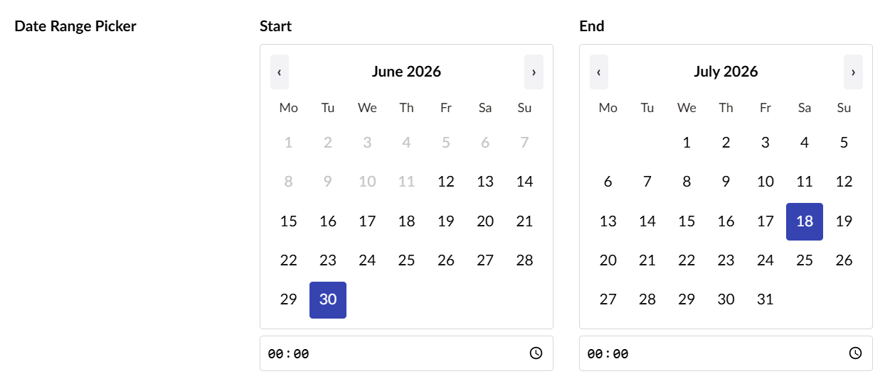
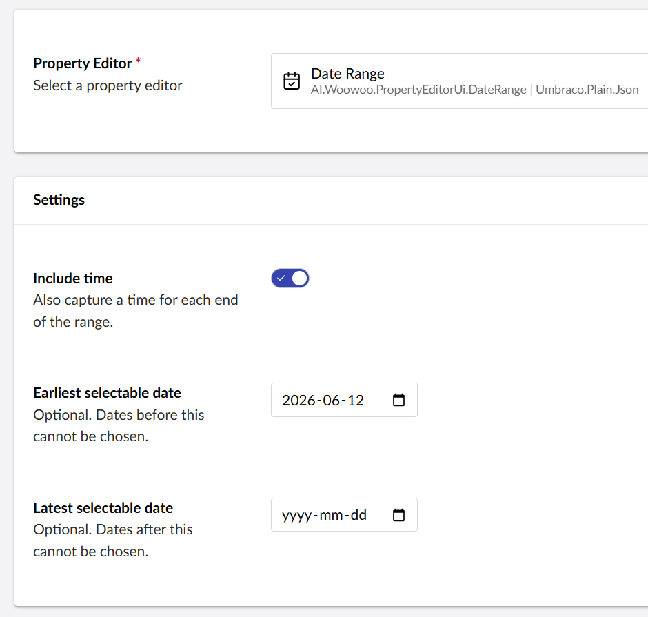

# Esatto.Umbraco.Backoffice.CustomEditors

A library of reusable **property editor UIs** for the Umbraco backoffice.



## Editors

### Masked Text Box — `Backoffice.CustomEditors.MaskedTextBox`

A text input that hides its value behind a reveal (👁) toggle — for API keys, secrets,
tokens and other sensitive fields. Masking is **on by default**, so it's safe to bind to
sensitive fields without configuration. On a content data type, a **Mask value** toggle lets
editors turn masking off.

> Masking is a UI affordance (it stops shoulder-surfing / screenshots). It does **not**
> encrypt the value — persistence/encryption is the responsibility of the consuming feature.

#### Use on a content Data Type
Create a Data Type using the **Masked Text Box** editor (stores a plain string), then assign
it to a document type property like any other editor.

#### Use from code (e.g. a custom settings schema)
Reference the editor UI alias directly:

```
Backoffice.CustomEditors.MaskedTextBox
```

For example, an Umbraco.AI provider can point a sensitive field's `EditorUiAlias` at this
alias so its connection setting renders masked.

### Date Range — `Esatto.Umbraco.Backoffice.CustomEditors.DateRange`

A date range editor that presents two **inline calendars** — a **start** and an **end** —
shown side by side with no popups.

- The end calendar is **constrained to the start**: days earlier than the chosen start are
  disabled and cannot be selected.
- Moving the start **past** an already-chosen end **clears the end**, so the range is never
  invalid.
- Click the already-selected day to **deselect** it (clearing the start clears the whole
  range).
- Configurable **date-only vs date+time** per data type — when time is enabled, each end gets
  a time input.
- Optional **min/max bounds** restrict the selectable dates on both calendars.
- The value is stored as JSON `{ "from": "...", "to": "..." }`, where each value is an
  **ISO 8601** string (`2026-05-01` in date-only mode, `2026-05-01T09:00:00` in date+time
  mode), or `null` when unset.

#### Use on a Data Type

1. Create a new **Data Type** and choose the **Date Range** editor.
2. Configure the available settings:
   - **Include time** — also capture a time for each end of the range (date+time mode).
   - **Earliest selectable date** — optional; dates before this cannot be chosen.
   - **Latest selectable date** — optional; dates after this cannot be chosen.
3. Assign the data type to a document type property like any other editor.



#### Read the value in Razor

The `Umbraco.Plain.Json` storage schema returns the value as a
`System.Text.Json.JsonDocument`, e.g. `{ "from": "2026-05-01", "to": "2026-05-10" }`
(with a time component in date+time mode). Parse it with `DateTimeStyles.RoundtripKind`,
which handles both the date-only and date+time forms:

```cshtml
@using System.Text.Json
@using System.Globalization

@{
    // Replace "yourPropertyAlias" with the alias of your Date Range property.
    var range = Model.Value<JsonDocument>("yourPropertyAlias");

    string? fromRaw = null;
    string? toRaw = null;

    if (range is not null && range.RootElement.ValueKind == JsonValueKind.Object)
    {
        if (range.RootElement.TryGetProperty("from", out var fromEl)
            && fromEl.ValueKind == JsonValueKind.String)
        {
            fromRaw = fromEl.GetString();
        }
        if (range.RootElement.TryGetProperty("to", out var toEl)
            && toEl.ValueKind == JsonValueKind.String)
        {
            toRaw = toEl.GetString();
        }
    }

    // RoundtripKind parses BOTH "2026-05-01" and "2026-05-01T09:00:00".
    DateTime? from = DateTime.TryParse(fromRaw, CultureInfo.InvariantCulture,
        DateTimeStyles.RoundtripKind, out var f) ? f : null;
    DateTime? to = DateTime.TryParse(toRaw, CultureInfo.InvariantCulture,
        DateTimeStyles.RoundtripKind, out var t) ? t : null;
}

@if (from.HasValue && to.HasValue)
{
    <p><strong>@from.Value.ToString("d MMM yyyy")</strong> &ndash;
       <strong>@to.Value.ToString("d MMM yyyy")</strong></p>
}
else
{
    <p><em>No date range set.</em></p>
}
```

> The property alias (`yourPropertyAlias` above) is whatever you named the property
> when you added the Date Range data type to your document type.

## Install

```
dotnet add package Esatto.Umbraco.Backoffice.CustomEditors
```

## Develop

The backoffice client lives in `Client/` (TypeScript + Lit + Vite). `dotnet build` runs the
client build automatically; the compiled assets are emitted to
`wwwroot/App_Plugins/Esatto.Umbraco.Backoffice.CustomEditors/`.

```
cd Client
npm install
npm run build      # or: npm run watch
npm test           # runs the Date Range logic tests (vitest)
```
